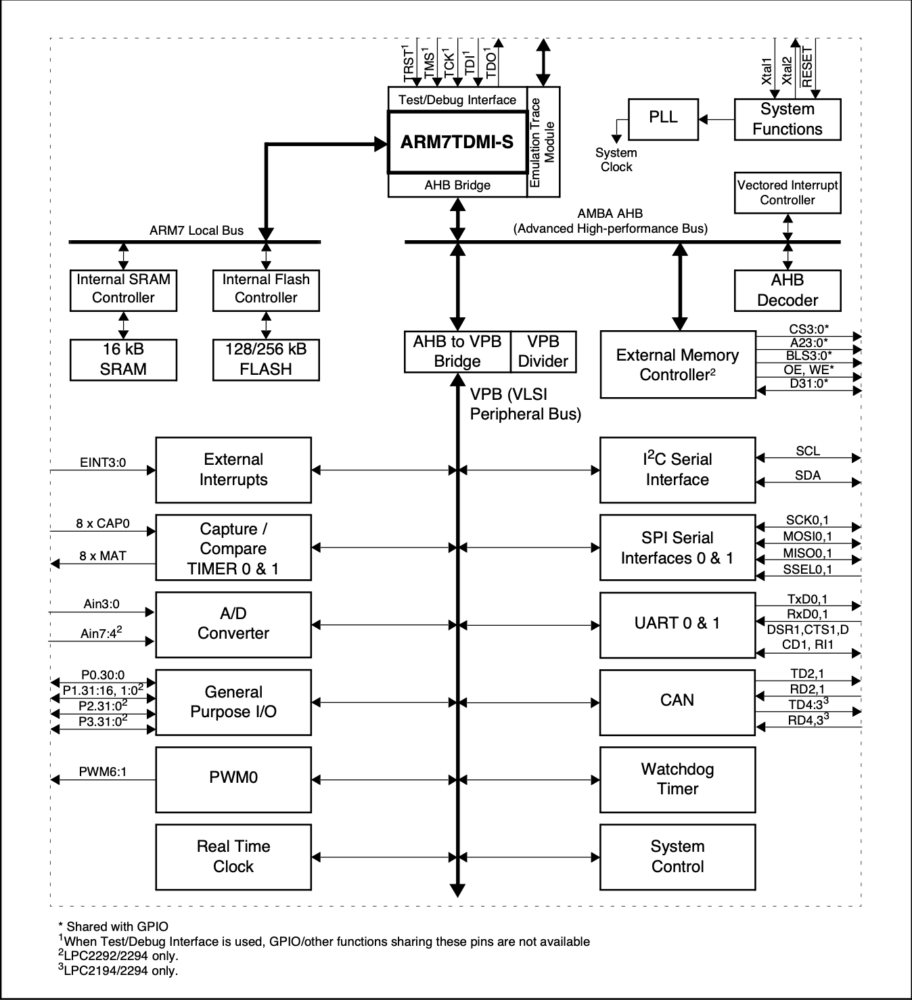

# Introduction to LPC2129

- The LPC2129 is an ARM-based microcontroller from **Philips Semiconductors** (now **NXP**).   
- It features a 16/32-bit **ARM7TDMI-STM** CPU with real-time emulation and embedded trace support.

## Features
- ### **Processor**   
     16/32-bit ARM7TDMI-S microcontroller.  

- ### **Memory**  
    - **16 kB** on-chip Static RAM.

    - **128/256 kB** on-chip Flash Program Memory, designed for high-speed **60 MHz** operation with a 128-bit wide interface/accelerator.

    - Supports In-System Programming (ISP) and In-Application Programming (IAP) via on-chip boot-loader software.

- ### **Timers and Control**

    - Two **32-bit** timers, each with **four capture** and **four compare** channels.

    - A **PWM** (Pulse Width Modulation) unit with 6 outputs.

    - Real Time Clock (RTC).

    - Watchdog Timer.

- ### **Serial Interfaces**

    - Two **UARTs** (16C550 compatible).

    - Fast **I2C** interface operating at up to **400 kbits/s**.

    - Two **SPIs™** (Serial Peripheral Interfaces).

    - Two advanced **CAN** channels.

- ### **Clock System**

    - **60 MHz** maximum CPU clock, derived from a programmable on-chip Phase-Locked Loop (PLL).

    - On-chip crystal oscillator with an operating range of **1 MHz** to **30 MHz**.

- ### **Interrupts**
    - **Vectored Interrupt Controller** with configurable priorities and vector addresses.

- ### **GPIO**
    - Up to 46 (in 64-pin package) 
    - 5 V tolerant general-purpose I/O pins.

- ### **External Interrupts**
    - Up to **12 independent external interrupt pins** available (EIN and CAP functions).

- ### **Power Management**
    - Two low-power modes 
        - Idle
        - Power-down
    - processor wake-up from Power-down mode via external interrupt.

- ### **Analog-to-Digital Converter** (ADC)
    - Features an 8-channel 10-bit ADC.

## Applications

- Industrial control 
- Medical systems
- Access control
- Point-of-sale
- Communication gateway
- Embedded soft modem
- general purpose applications

## LPC2129 Device Information

|No of pins|On-chip RAM|On-chip Flash|No of CAN channel|No of 10 bit AD Channels|
|:---:|:---:|:---:|:---:|:---:|
|64|16 kB|256kB|2|4|

## LPC2129 Block Diagram

