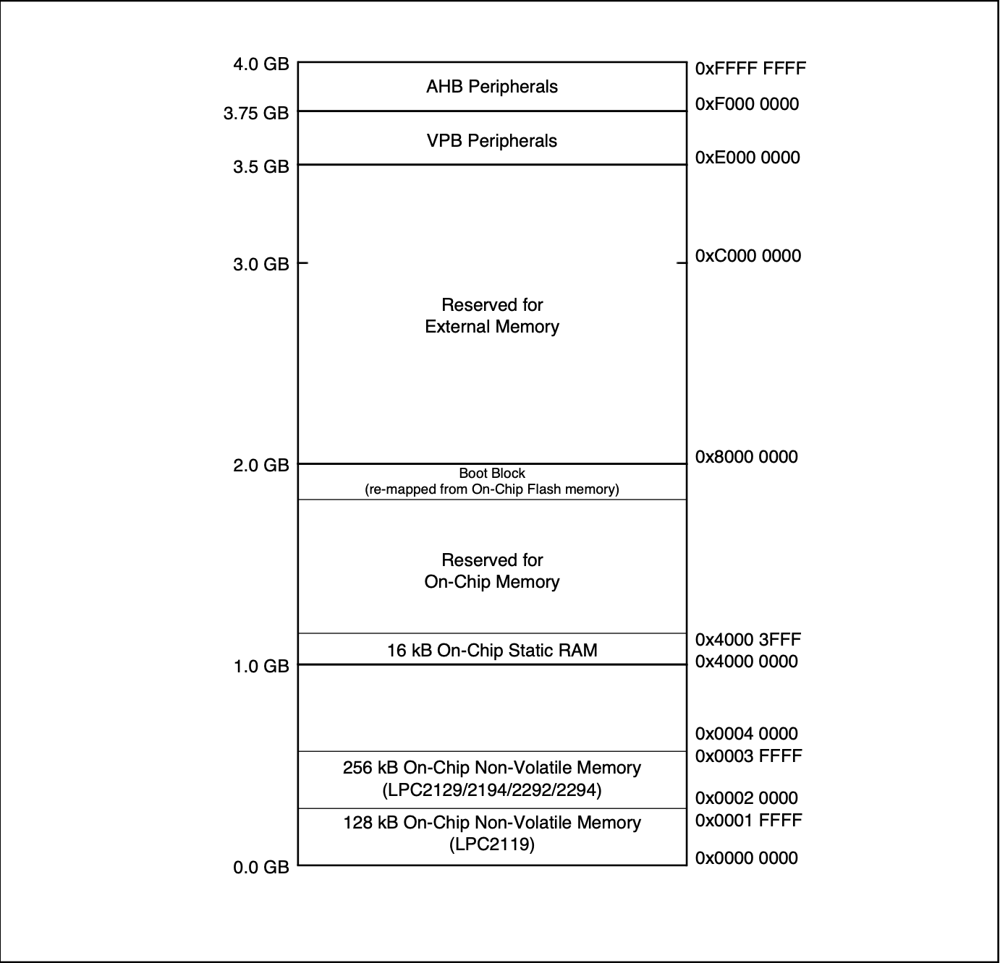
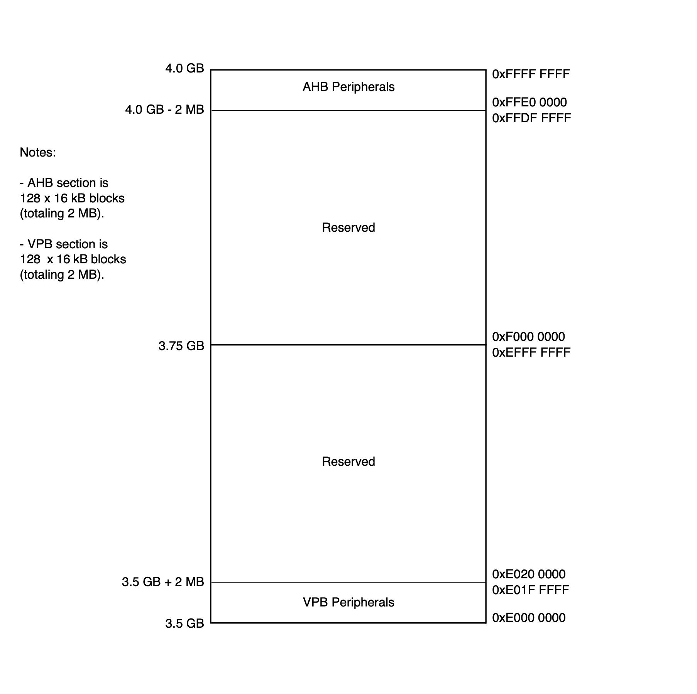
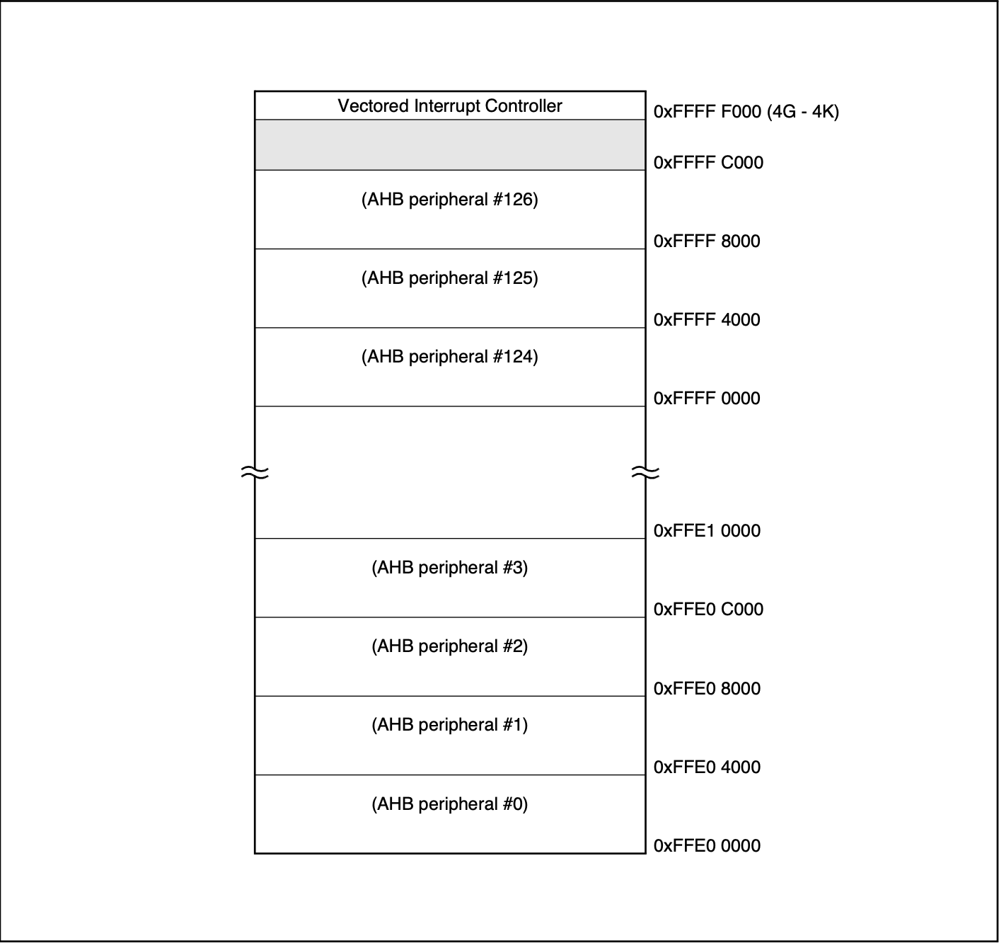
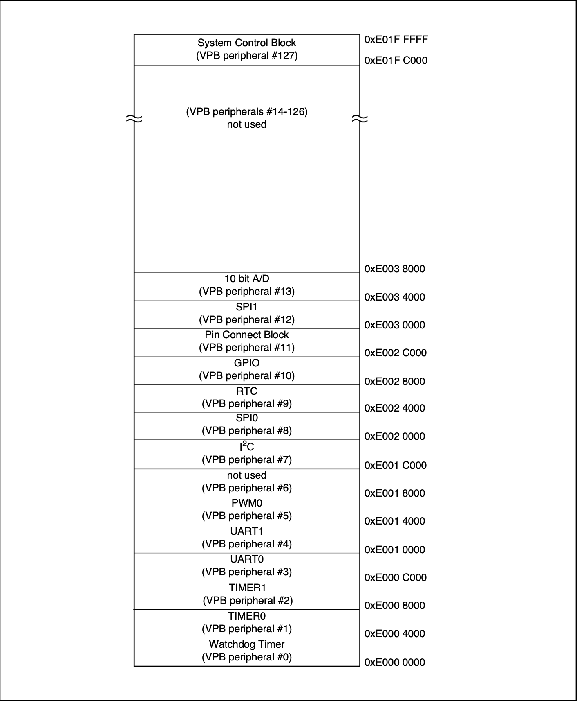

# Memory Addressing LPC2129

## Peripheral Memory Map

### AHB (Advanced High-performance Bus)

- **Purpose**   
The **AHB** is designed for high-performance modules that require high bandwidth
    - such as the **ARM7TDMI-S** CPU
    - on-chip memory controllers **(Flash and SRAM)**
    - the **Vectored Interrupt Controller (VIC)**.

- **Characteristics**   
It's a high-speed bus that allows for efficient data transfers between the CPU and fast **memory/peripherals**.

- **Memory Map**   
In the LPC2129,    
**AHB** peripherals are allocated a **2 megabyte** range of addresses at the very top of the **4 gigabyte ARM memory space** (starting from 0xF000 0000). 
    - Each AHB peripheral within this space gets a 16 kilobyte address space.

- **Connected Peripherals**   
The primary peripheral connected directly to the **AHB** in the LPC2129 is the **Vectored Interrupt Controller** (VIC). 
    - The **AHB** also interfaces with the on-chip memory controllers **(Flash and SRAM)**.

### VPB (VLSI Peripheral Bus)

- **Purpose**   
The **VPB** (VLSI Peripheral Bus) is a compatible **superset** of ARM's **APB** (Advanced Peripheral Bus). 
    - It's designed for connecting slower peripheral functions that don't require the high bandwidth of the AHB. 
    - This includes most of the standard peripherals like 
        - UARTs, SPI, I2C, Timers, PWM, ADC, GPIO, etc.

- **Characteristics**  
    - It's a simpler, **lower-power bus** compared to AHB. 
    - Suitable for peripherals where latency and throughput are less critical.

- **Memory Map**
    - VPB peripherals are also allocated a **2 megabyte** range of addresses
        - starting at the **3.5 gigabyte** address point (beginning from 0xE000 0000). 
    - Each VPB peripheral within this space also gets a **16 kilobyte** address space.

- **VPB Divider** 
    - A key component related to the VPB is the VPB Divider. 
    - This allows the **VPB clock (pclk)** to run at a slower rate  
     (e.g., one-half or one-fourth) than the **main processor clock (cclk)**. 
    - This is done to save power and to allow peripherals to operate at their optimal speeds, independent of the faster CPU clock. 
    - The **VPBDIV register** controls this **clock division**.

- **AHB-to-VPB Bridge** 
    - Since the CPU primarily interacts with the AHB, there's an AHB-to-VPB bridge that interfaces the VPB bus to the AHB bus. This bridge allows the ARM processor to access the VPB peripherals.