# 📑 Project Report

# Title: IoT Dashboard using LPC2129 Microcontroller with Temperature, Speed, LED Control, and LCD Display

## 1. Introduction

This project implements a local IoT-style control and monitoring system using the LPC2129 ARM7TDMI-S microcontroller.
The system gathers data from:

- A temperature sensor (MCP9700)

- A potentiometer (used as Speed control)

and sends these readings to a local HTTP server running on a laptop via UART0 serial communication.

The HTTP server displays this data on a web page and provides interactive controls to:

- Toggle three LEDs connected to LPC2129.

Send a text message from the browser to be displayed on a 16x2 LCD module connected to LPC2129.

## 2. System Overview
### Block Diagram

```mermaid
flowchart TD
    A[Temperature Sensor MCP9700] -->|Analog| B[LPC2129 Microcontroller]
    C[Potentiometer] -->|Analog| B
    B -->|UART0 TX/RX| D[Laptop - HTTP Server in C]
    B -->|GPIO| E[LED1 P0.17]
    B -->|GPIO| F[LED2 P0.18]
    B -->|GPIO| G[LED3 P0.19]
    B -->|GPIO| H[LCD Module P1.17–P1.23]
    D -->|Wi-Fi/LAN| I[Smartphone Browser]
```

## 3. Hardware Requirements

- LPC2129 Rhydolabz Development Board

- MCP9700 Temperature Sensor (connected to ADC2, P0.29)

- Onboard Potentiometer (ADC1, P0.28)

- 16x2 HD44780 LCD Module (P1.17–P1.23)

- 3 Onboard LEDs (P0.17, P0.18, P0.19 — Active Low)

- USB-to-Serial Converter (connected to UART0, P0.0 TX / P0.1 RX)

- Laptop running macOS

- Smartphone (connected to same Wi-Fi network)

## 4. Pin Mapping Table

|Peripheral|PortPin|Function|Notes|
|---|---|---|---|
|LED1|P0.17	|Output (Active Low)	|Jumper J1 enabled|
|LED2|	P0.18|	Output (Active Low)	|Jumper J2 enabled|
|LED3|	P0.19|	Output (Active Low)	|Jumper J3 enabled|
|Potentiometer|	P0.28|	ADC1|	Speed input|
|Temp Sensor	|P0.29	|ADC2	|MCP9700 output|
|LCD RS	|P1.17	|Control	|RS pin|
|LCD RW	|P1.18	|Control	|Tie low for write|
|LCD EN	|P1.19	|Control	|Enable strobe|
|LCD D4–D7	|P1.20–P1.23	|Data	|4-bit mode|
|UART0 TX	|P0.0	|Serial Output	|To laptop RX|
|UART0 RX	|P0.1	|Serial Input	|From laptop TX|
## 5. Software Components
### 5.1 LPC2129 Firmware

- UART0 @ 9600 baud for communication.

- ADC for Temp & Speed values.

- LCD in 4-bit mode.

- Sends Temp:xx.xxC Speed:yyy\n every 5s.

Receives UART commands:
```
1–3: Turn ON LEDs (active-low).

4–6: Turn OFF LEDs.

Text + #: Display on LCD.
```

### 5.2 C HTTP Server

Uses ```/dev/cu.usbserial-0001``` at ```9600``` baud.

Parses only valid lines (Temp:xx.xxC Speed:yyy).

Hosts web server on IP:8080.

Webpage includes:

Sensor Data (auto-refresh 5s).

LED control buttons.

Text input for LCD.

Accessible via PC & Smartphone.

## 6. Flow Diagrams
### 6.1 LPC2129 Firmware Flow

### 6.2 HTTP Server Flow

## 7. Conclusion

This project integrates embedded system data acquisition with a local IoT-style web interface.

LPC2129 handles ADC readings, LED outputs, and LCD control.

C-based HTTP Server processes UART data and exposes a web dashboard.

Smartphone & PC browsers can access and control the system over LAN.

- It demonstrates how an older microcontroller like LPC2129 can be connected to modern IoT/web technologies for monitoring and control.