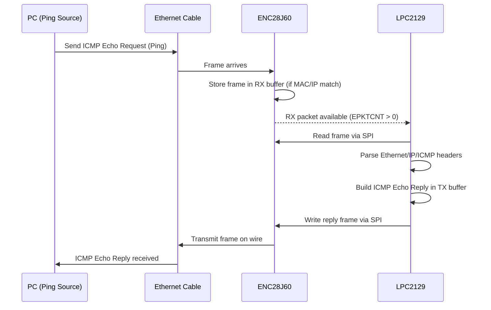

ENC28J60 WORKING
---
## 1. Boot & Clock Setup (LPC2129 side)

1. **Reset occurs** → CPU starts from address `0x00000000` (vector table in Flash).
2. **Startup code** runs → sets up stack, initializes `.bss` and `.data`.
3. **`main()` starts**:

   * Calls `clock_init_60mhz()`:

     * Configures **PLL0** to multiply the 12 MHz crystal → 60 MHz CPU clock.
     * Sets **VPBDIV = 4**, so **PCLK = 15 MHz** (peripherals, including SPI).
     * Configures **MAM** (Memory Accelerator) for Flash access at 60 MHz.

At this point, the microcontroller core and bus clocks are stable.

---

## 2. ENC28J60 SPI Initialization

1. **`enc28j60_spi_init()`**:

   * Configures **P0.4 = SCK0, P0.5 = MISO0, P0.6 = MOSI0**.
   * Configures **P1.20 as GPIO output** (Chip Select).
   * Sets **SPI0 Master Mode**: 8-bit transfers, \~1.875 MHz speed.

2. **`enc28j60_init(mac)`**:

   * Issues **Soft Reset** (`SRC` command via SPI).
   * Configures **RX buffer** (`0x0000 – 0x0FFF`) and **TX buffer** (`0x1000 – 0x1FFF`) inside ENC28J60’s internal 8KB RAM.
   * Enables **receive filters** (accept own MAC, broadcast, CRC).
   * Configures **MAC registers**:

     * Padding & CRC insertion.
     * Inter-packet gap.
     * Max frame length (1518).
   * Loads **device MAC address**.
   * Configures **PHY** (disables loopback, sets LED indicators).
   * Enables **auto-increment** and **RX logic** (`ECON1.RXEN=1`).

At this stage, ENC28J60 is “listening” on the Ethernet line, receiving frames and storing them in RX buffer.

---

## 3. Runtime Data Flow

Now the system is in its **main loop**:

### 3.1. Reception (RX Path)

1. **Ethernet frame arrives** from the network (e.g., a Ping request).
2. ENC28J60 **filters the frame**:

   * If **dest MAC matches our MAC** or **broadcast**, it stores it in RX buffer.
   * Increments packet counter (`EPKTCNT`).
3. **LPC2129 polls ENC28J60**:

   * Calls `enc28j60_receive_packet()`.
   * If `EPKTCNT > 0`, reads:

     * **Next packet pointer**.
     * **Frame length**.
     * **Receive status**.
     * Frame payload → copied into `rxbuf[]`.
   * Updates RX read pointer, decrements packet counter.

At this point, the raw Ethernet frame is in MCU RAM.

---

### 3.2. Processing (Parsing in MCU)

1. Check **EtherType**:

   * If `0x0800` → IPv4 frame.
   * Otherwise, ignore.
2. Inside IPv4:

   * Check **Protocol = 1 (ICMP)**.
   * Verify **Destination IP = 192.168.1.100**.
   * If **ICMP Type = 8 (Echo Request)** → proceed.
3. Build ICMP Reply:

   * Swap **Source/Destination MAC**.
   * Swap **Source/Destination IP**.
   * Set ICMP Type = 0 (Echo Reply).
   * Recompute **IP checksum** and **ICMP checksum**.
   * Copy payload data (ping data remains unchanged).

Now the outgoing frame is fully built in `txbuf[]`.

---

### 3.3. Transmission (TX Path)

1. `enc28j60_send_packet(len, txbuf)`:

   * Sets **write pointer** in ENC28J60 to TX buffer start.
   * Writes **control byte** (`0x00`).
   * Writes Ethernet frame bytes (14-byte Ethernet header + IP + ICMP).
   * Sets **TXND pointer** to mark the end of frame.
   * Sets **TXRTS** bit (Request to Send).
2. ENC28J60 transmits frame on the Ethernet line.
3. Once done, ENC28J60 clears **TXRTS**, signaling TX complete.

---

## 4. Data Flow Diagram

---

## 5. Summary of Data Flow

* **Boot:** MCU sets up PLL + SPI, ENC28J60 reset.
* **Init:** ENC28J60 configured with MAC, IP, RX/TX buffers.
* **Runtime:**

  1. Packet arrives → stored in ENC RX buffer.
  2. MCU polls → copies into RAM.
  3. MCU parses → builds ICMP reply.
  4. MCU sends reply → ENC transmits back to PC.

---
